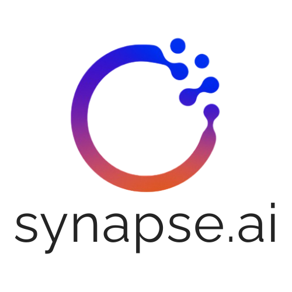

<p align="center">
  
</p>

<h1 align="center">Servidor MCP para Trello</h1>

<p align="center">
  <a href="./LICENSE">
    
  </a>
  <a href="https://modelcontextprotocol.io">
    
  </a>
  <a href="https://www.python.org/downloads/">
    
  </a>
</p>

<h3 align="center">Gestioná tableros, listas, tarjetas, etiquetas y checklists de Trello desde cualquier cliente MCP (Cursor, Claude, etc.)</h3>

---

## Presentación

**Trello MCP** es un servidor [Model Context Protocol](https://modelcontextprotocol.io) que expone la API REST de Trello como herramientas que un asistente de IA puede usar desde el editor o el chat. Sin salir del flujo de trabajo, podés listar tableros, crear y mover tarjetas, gestionar checklists, comentarios y adjuntos, y buscar en Trello.

Ideal para equipos que usan Trello y quieren integrarlo con asistentes (por ejemplo en Cursor o Claude) para automatizar tareas, consultar estado de proyectos o actualizar tarjetas por lenguaje natural.

### ✨ Características principales

- **Tableros y listas**: Listar tus tableros, obtener listas de un board, crear listas.
- **Tarjetas**: Crear, editar, mover, archivar; obtener detalle completo (incluye IDs de checklists, miembros, badges y metadatos).
- **Checklists**: Obtener checklist con ítems, crear checklists en una tarjeta, agregar ítems.
- **Comentarios y adjuntos**: Leer y agregar comentarios; adjuntar URLs o archivos; eliminar adjuntos.
- **Etiquetas**: Listar etiquetas de un board, crear etiquetas.
- **Búsqueda**: Buscar tarjetas y/o tableros en Trello.
- **Perfil**: Obtener el perfil del miembro autenticado.

---

## Herramientas disponibles

| Herramienta | Descripción |
|-------------|-------------|
| `list_my_boards` | Lista todos los tableros del usuario autenticado |
| `get_board` | Detalle de un tablero |
| `get_board_lists` | Listas de un tablero |
| `create_list` | Crear una lista en un tablero |
| `get_list_cards` | Tarjetas de una lista |
| `get_board_cards` | Tarjetas de un tablero |
| `get_card` | Detalle completo de una tarjeta (incl. idChecklists, idMembers, badges, etc.) |
| `create_card` | Crear una tarjeta en una lista |
| `update_card` | Actualizar campos de una tarjeta |
| `move_card` | Mover una tarjeta a otra lista o tablero |
| `archive_card` | Archivar (cerrar) una tarjeta |
| `get_card_comments` | Comentarios de una tarjeta |
| `add_card_comment` | Agregar un comentario a una tarjeta |
| `get_card_attachments` | Adjuntos de una tarjeta |
| `add_card_attachment` | Subir un archivo como adjunto |
| `add_card_url_attachment` | Adjuntar una URL |
| `delete_card_attachment` | Eliminar un adjunto |
| `get_board_labels` | Etiquetas de un tablero |
| `create_label` | Crear una etiqueta en un tablero |
| `get_checklist` | Obtener un checklist y sus ítems |
| `create_checklist` | Crear un checklist en una tarjeta |
| `add_checklist_item` | Agregar un ítem a un checklist |
| `get_me` | Perfil del miembro autenticado |
| `search_trello` | Buscar tarjetas y/o tableros |

---

## Requisitos previos

1. Entrá a [trello.com/power-ups/admin](https://trello.com/power-ups/admin) y creá un Power-Up.
2. Copiá tu **API Key**.
3. Generá un **Token** con el enlace que aparece en la misma página.

---

## Instalación

**Con pip** (desde GitHub):

```bash
pip install "git+https://github.com/synapse-ai-hub/trello-mcp.git"
```

**Con uv**:

```bash
uv pip install "git+https://github.com/synapse-ai-hub/trello-mcp.git"
```

**Desarrollo** (clone y dependencias en modo editable):

```bash
git clone https://github.com/synapse-ai-hub/trello-mcp.git
cd trello-mcp
python -m venv .venv
# Windows: .\.venv\Scripts\Activate.ps1
# Linux/macOS: source .venv/bin/activate
pip install -e ".[dev]"
pytest
```

---

## Uso

### Cursor / Claude Desktop / Claude Code

En la configuración MCP del cliente (por ejemplo `.mcp.json`), apuntá al mismo Python donde instalaste el paquete:

```json
{
  "mcpServers": {
    "trello": {
      "command": "python",
      "args": ["-m", "trello_mcp"],
      "env": {
        "TRELLO_API_KEY": "tu-api-key",
        "TRELLO_TOKEN": "tu-token"
      }
    }
  }
}
```

Si usás un venv dedicado para el MCP, indicá la ruta completa al intérprete:

```json
"command": "C:/ruta/al/venv/Scripts/python.exe"
```

---

## Conflictos de dependencias (FastAPI / Starlette)

Este servidor depende de **Starlette** y **sse-starlette**. Si en el mismo venv tenés **FastAPI**, pueden generarse conflictos de versiones.

**Recomendación:** usar un venv dedicado para el MCP e indicar en el IDE la ruta a ese intérprete.

**1. Crear venv e instalar:**

```bash
python -m venv C:\tools\mcp-venv
C:\tools\mcp-venv\Scripts\Activate.ps1
pip install "git+https://github.com/synapse-ai-hub/trello-mcp.git"
```

**2. En Cursor / VS Code** (`.mcp.json`), usar la ruta a ese Python:

```json
{
  "mcpServers": {
    "trello": {
      "command": "C:/tools/mcp-venv/Scripts/python.exe",
      "args": ["-m", "trello_mcp"],
      "env": {
        "TRELLO_API_KEY": "tu-api-key",
        "TRELLO_TOKEN": "tu-token"
      }
    }
  }
}
```

En Linux/macOS sería algo como `"command": "/ruta/al/mcp-venv/bin/python"`.

Así el MCP corre con sus propias dependencias y tu proyecto FastAPI mantiene las suyas en otro venv.

---

## Variables de entorno

| Variable | Requerida | Descripción |
|----------|:---------:|-------------|
| `TRELLO_API_KEY` | Sí | API key del Power-Up de Trello |
| `TRELLO_TOKEN` | Sí | Token de usuario generado para tu API key |

---

## Desarrollo

```bash
git clone https://github.com/synapse-ai-hub/trello-mcp.git
cd trello-mcp
python -m venv .venv && source .venv/bin/activate   # o en Windows: .\.venv\Scripts\Activate.ps1
pip install -e ".[dev]"
pytest
```

---

## Estructura del proyecto

```plaintext
trello-mcp/
├── src/
│   ├── trello_mcp/     # Paquete Python
│   │   ├── tools/      # boards, cards, lists, checklists, labels, attachments, search, members
│   │   ├── client.py
│   │   ├── config.py
│   │   ├── exceptions.py
│   │   ├── server.py
│   │   └── __main__.py
│   └── LogoBlancoGrande2.png   # Logo
├── tests/
├── pyproject.toml
├── README.md
└── LICENSE
```

---

## Licencia

Este proyecto está bajo la licencia [MIT](./LICENSE).

---

## Sobre este repositorio

Mantenido por [Synapse](https://github.com/synapse-ai-hub). 
